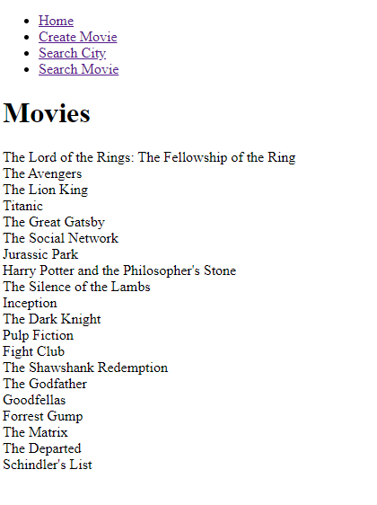
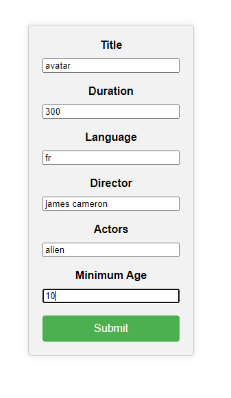
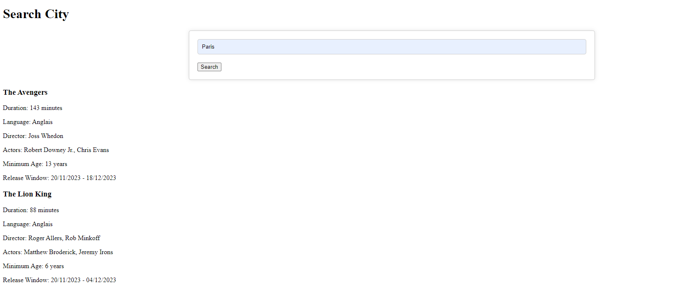
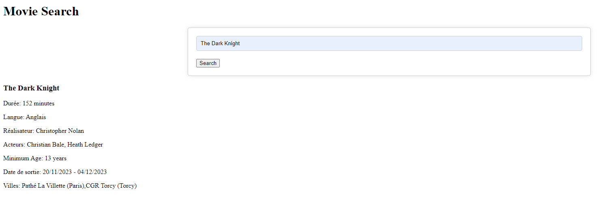

# Cinema-Rest-API

The project consist to create an api with the rest technology using Java programming language.  
The purpose is to create a web application in order to monitoring the differents film released and seance in all french's theatres.  

The application provide 3 webservices for the user :  

* Publication of new movies and all it schedules

* Diplaying all movies projected in a city

* Displaying all cities where a film is projected

Master 1 project made for the API & Web Services cursus at Efrei Paris.  
Made with Sivananthan Sarankan and Sebastiao-Esteves Kevin.  
